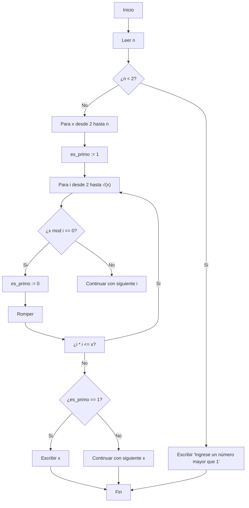

# RETO-03

## Planteamiento del algoritmo para obtener los números primos hasta n
El objetivo es crear un algoritmo que nos permita obtener todos los números primos menores o iguales a un número n. Para ello, debemos verificar si cada número en ese rango (desde 2 hasta n) es primo.

## Algoritmo en Pseudocódigo
Plantear el siguiente algoritmo:
```
Inicio
Paso 1. Repetir para cada número x desde 2 hasta n
    Paso 1.1 Crear una lista de números naturales desde 2 hasta √x más 1
    Paso 1.2 Repetir para cada número i de la lista:
        Paso 1.2.1 Dividir x entre i
        Paso 1.2.2 Si el residuo es 0, entonces:
            Paso 1.2.2.1 Escribir "x no es primo"
            Paso 1.2.2.2 Terminar el ciclo
        Paso 1.2.3 Si el residuo no es 0, continuar con el siguiente número i
    Paso 1.3 Si no se encontró ningún divisor (es decir, el ciclo de i no fue interrumpido), escribir "x es un número primo"
Fin

```
### Entrada y Proceso:
Entrada: Un número entero 𝑛 (el límite hasta donde se buscan los primos).

Proceso: Para cada número 𝑥 desde 2 hasta 𝑛, se verifica si 𝑥 es divisible por algún número 𝑖 en el rango desde 2 hasta √𝑥 (esto mejora la eficiencia).

Salida: Los números primos menores o iguales a 𝑛.

### PSEUDOCÓDIGO
```
[variables]
n : entero     // El número hasta donde buscar los primos
x : entero     // Número a evaluar si es primo
i : entero     // Divisor para comprobar si x es divisible
es_primo : entero // Para determinar si x es primo (1 = primo, 0 = no primo)

inicio
    Leer n       // Pedir al usuario el valor de n
    Si n < 2 entonces
        Escribir "Ingrese un número mayor que 1"
    Sino
        Para x desde 2 hasta n hacer  // Empezamos a revisar desde 2 hasta n
            es_primo := 1     // Asumimos que x es primo
            Para i desde 2 hasta √(x) hacer  // Comprobamos si x tiene divisores
                Si (x mod i == 0) entonces  // Si es divisible por i
                    es_primo := 0   // No es primo
                    Romper // Salir del bucle
                FinSi
            FinPara
            Si es_primo == 1 entonces  // Si es primo, lo mostramos
                Escribir x
            FinSi
        FinPara
    FinSi
fin

```
### Diagrama de flujo
El diagrama de flujo te ayudará a visualizar el proceso de forma más clara. Aquí te explico cómo lo organizaríamos en un diagrama de flujo:


